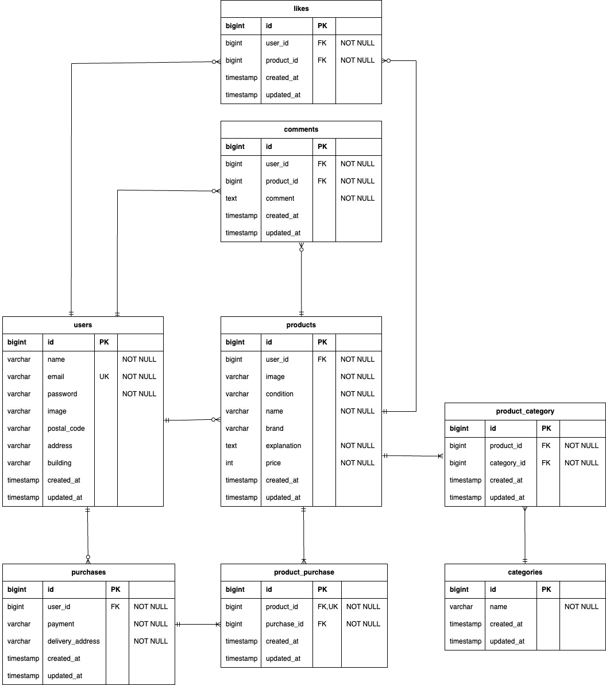

# flea-market
## 環境構築
### Dockerビルド
　　１.git clone git@github.com:marina-ob/flea-market.git\
　　２.docker-compose up -d --build\
  \
 ＊MySQLは、OSによって起動しない場合があるのでそれぞれのPCに合わせてdocker-compose.ymlファイルを編集してください。
### Laravel環境構築
　　１.docker-compose exec php bash\
　　2.composer install\
　　３..env.exampleファイルから.envを作成し、環境変数を変更\
　　４.php artisan key:generate\
　　５.php artisan migrate\
　　６.php artisan db:seed

#### メールの認証
　MailHog を使用してメール認証を行います。\
　- MailHog（最新バージョンを使用）\
　- WebUI：http://localhost:8025 \
　- `docker-compose up -d` で起動

#### Stripe 設定
　Stripe を使用して決済処理を行います。\
　- `stripe/stripe-php: 10.17.0` を使用\
　- 環境変数 `.env` に `STRIPE_KEY` と `STRIPE_SECRET` を設定

## 開発環境  
  
　・商品一覧画面：http://localhost \
　・ユーザー登録：http://localhost/register \
　・MailHog：http://localhost:8025 \
　・phpMyAdmin：http://localhost:8080
  
## 使用技術（実行環境）  
  
　・PHP 8.4.1\
　・Laravel 8.83.29\
　・MySQL 8.0.26\
　・nginx 1.21.1\
　・MailHog(メール認証)\
　・Stripe(決算処理)\
　・PHPUnit / Pest（ユニット・機能テスト）\
　・Cypress（E2E テスト）

 ## テスト環境のセットアップ
 
　・プロジェクトではテスト用に mysql_test という接続を使用しています。\
\
　・テスト環境では、以下の設定を .env.testing に記述。\
　　データベース設定のみテスト用のデータベース `demo_test`、\
　　メール認証（MailHog）と Stripe のテストキーは本番環境と同じ設定を使用します。  
\
　APP_NAME=Laravel\
　APP_ENV=test\
　APP_KEY=base64:gFUAC0QP8GqGomz8k1gK/RA+dtHD0TJSo2Ososjv9/0=\
　APP_DEBUG=true\
　APP_URL=http://localhost

##### データベース設定（テスト用）
　DB_CONNECTION=mysql\
　DB_HOST=mysql\
　DB_PORT=3306\
　DB_DATABASE=demo_test\
　DB_USERNAME=root\
　DB_PASSWORD=root\
\
　＊config/database.php の connections 配列に追加した mysql_test 設定を利用しています。\
 　　もし設定を変更した場合は、再度 .env.testing も確認して調整してください。\
\
\
　・テストデータベースの作成・マイグレーションの実行\
　　php artisan migrate --env=testing\
\
　・シーディングの実行\
　　php artisan db:seed --env=testing

### テストの実行方法
#### ユニット・機能テスト（PHPUnit / Pest）
　以下のコマンドで実行できます。\
　　php artisan test

#### E2E テスト（Cypress）
　Cypressのテストは、`cypress/e2e` フォルダに配置されています。\
　これらのテストファイルは、Cypressを使ってUIの動作を確認するために使用されます。\
\
　・Cypress のセットアップ\
　　　Cypress は `devDependencies` に含まれているため、以下のコマンドでインストールされます。\
　　　　npm install
\
　　　Cypress を起動するには、以下のコマンドを実行してください。\
　　　　npx cypress open   　　 （Cypress のGUIを開く）\
　　　　npx cypress run　　　　　（テストを実行）

　＊Cypressを実行すると、GUIが開き、ブラウザで各テストを実行することができます。\
　　また、`npx cypress run` を実行すると、ターミナル上でテスト結果が確認できます。

## ER図

